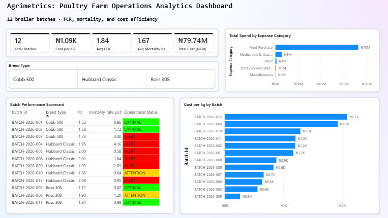
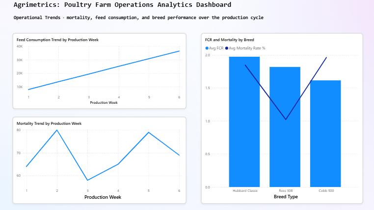
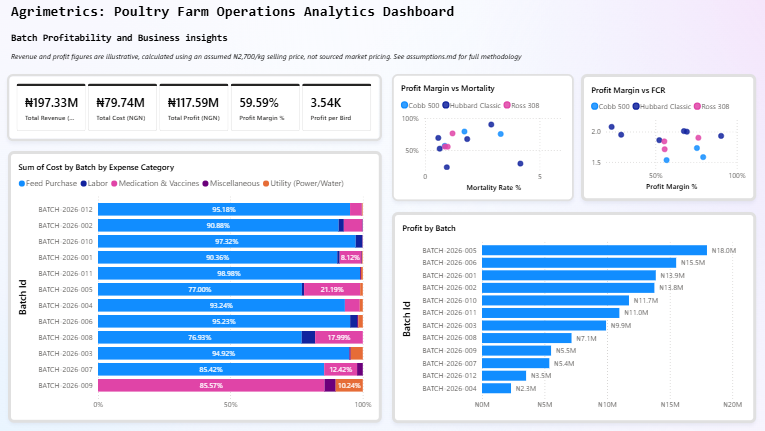

# Agrimetrics: Poultry Farm Operations Analytics Dashboard

A SQL-first analytics project analyzing 12 broiler production batches: feed efficiency, mortality, cost, and profitability. Built on a synthetic dataset modeled after real poultry farm operations, with a Python data-generation layer, MySQL analysis, Excel reporting, and a 3-page Power BI dashboard.

## The business question

Farm management can see individual batch records, but has no consolidated view of which batches are performing well, which need attention, where cost is concentrated, or whether operations are actually profitable. This project builds that view.

## Project structure

```
agrimetrics/
├── data/
│   ├── raw/              # batches, daily_logs, financials, batch_summary_metrics
│   └── processed/        # batch_scorecard.csv, exported analysis output
├── scripts/
│   └── generate_data.ipynb   # synthetic data generation (Google Colab)
├── sql/
│   ├── 01_schema_setup.sql
│   ├── 02_analysis_queries.sql
│   ├── 03_advanced_insights.sql
│   └── 04_excel_export_query.sql
├── excel/
│   └── farm_summary_workbook.xlsx
├── powerbi/
│   └── agrimetrics_dashboard.pbix
├── docs/
│   ├── assumptions.md
│   └── screenshots/
│       ├── dashboard_overview.png
│       ├── dashboard_trends.png
│       └── dashboard_profitability.png
└── README.md
```

## Data

12 broiler batches (Cobb 500, Ross 308, Hubbard Classic breeds) over standard 42-day production cycles, with:
- **504 daily operational logs**: mortality, feed consumption, and weight, per batch per day
- **~60 financial entries**: feed, medication, labor, utilities, and miscellaneous costs per batch
- **Batch-level summary metrics**: FCR and mortality rate, derived from the daily logs

The dataset is synthetic, but FCR is not hardcoded. It emerges from a breed-specific logistic growth curve against feed intake, the same way it would on a real farm.

## Tech stack

**Python, in a Google Colab notebook** (`scripts/generate_data.ipynb`): synthetic data generation, using `pandas` for the dataframes and CSV exports, `NumPy` for the growth-curve math and randomization, and the `Faker` library alongside a fixed random seed (`SEED = 42`) so the dataset is fully reproducible on every run.

**MySQL, via MySQL Workbench**: schema design, business-intelligence queries, and advanced window functions (`NTILE`, running aggregations across production weeks).

**Microsoft Excel**: a formatted reporting workbook, including a PivotTable built on a live named table, conditional formatting, and embedded charts.

**Power BI Desktop, with DAX**: the interactive 3-page dashboard, including a custom Date table and calculated measures/columns for cost, profitability, and the operational risk classification.

## How to reproduce

**Prerequisites**: Google account (for Colab), MySQL Server + MySQL Workbench, Microsoft Excel, Power BI Desktop.

1. Open `scripts/generate_data.ipynb` in Google Colab and run all cells. This generates `batches.csv`, `daily_logs.csv`, `financials.csv`, and `batch_summary_metrics.csv` (the `faker` package installs automatically in the first cell; `pandas` and `NumPy` are preinstalled in Colab).
2. In MySQL Workbench, run `sql/01_schema_setup.sql` to create the `agrimetrics_db` database and its four tables.
3. Import each generated CSV into its matching table using Workbench's Table Data Import Wizard (right-click the table → Table Data Import Wizard).
4. Run `sql/02_analysis_queries.sql`, `sql/03_advanced_insights.sql`, and `sql/04_excel_export_query.sql`, in that order, to reproduce the business queries, window-function insights, and the Excel export result set.
5. Open `excel/farm_summary_workbook.xlsx` to view the formatted reporting workbook, or rebuild the Batch Scorecard sheet from the Query 4 result set if regenerating from scratch.
6. Open `powerbi/agrimetrics_dashboard.pbix` in Power BI Desktop. If prompted to reconnect, point it at your local `agrimetrics_db` via the MySQL connector, then Refresh.

## Key findings

- **Feed Purchase dominates cost**: roughly 91% of total farm spend across all 12 batches, far ahead of medication, labor, utilities, and miscellaneous combined, though this ranges from 76.93% to 98.98% batch to batch.
- **Breed affects performance measurably**: Hubbard Classic runs meaningfully higher on both FCR and mortality than Ross 308 and Cobb 500, which post the strongest efficiency numbers.
- **Farm-wide average FCR is ~1.84**, with a real spread of 1.53 to 2.08 across batches, wide enough that a single fixed threshold can't meaningfully flag risk (see Methodology below).
- **6 of 12 batches flag as ALERT**, 2 as ATTENTION, 4 as OPTIMAL under the operational risk classification: a genuine three-way split, not a batch that's either "fine" or "on fire."
- **At an assumed ₦2,700/kg selling price**, the farm's 12 batches show a combined margin of ~59.6%, but batch-level profit varies widely, from ₦2.3M to ₦18.0M, showing that farm-wide profitability figures can mask real per-batch variation.

## Methodology: Operational Status classification

Batches are flagged using **data-relative benchmarks**, not fixed industry thresholds:

- **ALERT**: FCR > farm average × 1.05, OR mortality rate > farm average × 1.5
- **ATTENTION**: FCR above farm average but below the ALERT threshold
- **OPTIMAL**: FCR at or below farm average

This was a deliberate design choice, not an arbitrary one. An earlier version used a fixed threshold (`FCR > 2.0`), which flagged every batch identically because it didn't match this farm's actual FCR distribution, providing zero differentiation. A second attempt used a data-relative benchmark but with too tight a buffer (0.5%), which collapsed the classification to a binary split again for the same underlying reason. The current version (5% buffer) was calibrated against the dataset's real spread and produces genuine three-tier differentiation. Full revision history is in `docs/assumptions.md`.

## Dashboard

**Page 1, Executive Performance Overview**: farm-wide KPIs, cost breakdown by category, cost efficiency by batch, and a color-coded batch performance scorecard.



**Page 2, Operational Trends Analysis**: mortality and feed consumption trends across the production cycle, and FCR/mortality performance compared across breeds.



**Page 3, Batch Profitability Analysis**: revenue, profit, and margin by batch, profitability against FCR and mortality, and cost structure by batch.



> Page 3's revenue and profit figures are **illustrative**, calculated using an assumed ₦2,700/kg selling price, since the underlying dataset has no recorded market pricing. This is stated directly on the dashboard page itself and documented in full in `assumptions.md`. Every other figure in this project (cost, FCR, mortality, feed consumption) comes directly from the generated operational data with no assumption layer.

## Data quality notes

This project includes real fixes worth mentioning, not just a finished output. A stale Excel pivot table that disagreed with the underlying data by ~₦26M was traced to a broken cache and rebuilt on a live named table. The operational risk threshold went through two revisions before the classification logic actually matched the data's real distribution. A verification script (kept local, not in this repo) independently recomputes FCR and mortality from raw daily logs to catch any future import or calculation drift. Full details in `docs/assumptions.md`.

## Future enhancements

- A feed wastage metric, once a defined "expected consumption" benchmark (e.g. breed-standard feed curves) is sourced and documented as its own assumption
- Batch-level drill-through in Power BI for a full per-batch operational and financial breakdown
- Replacing the assumed selling price with real market data, if/when available

## Author

Arotiba Emmanuel Oluwadabira, data analyst with an agribusiness focus.

## Connect

- **GitHub:** [e-arotiba](https://github.com/e-arotiba)
- **LinkedIn:** [linkedin.com/in/emmanuelarotiba](https://www.linkedin.com/in/emmanuelarotiba/)
